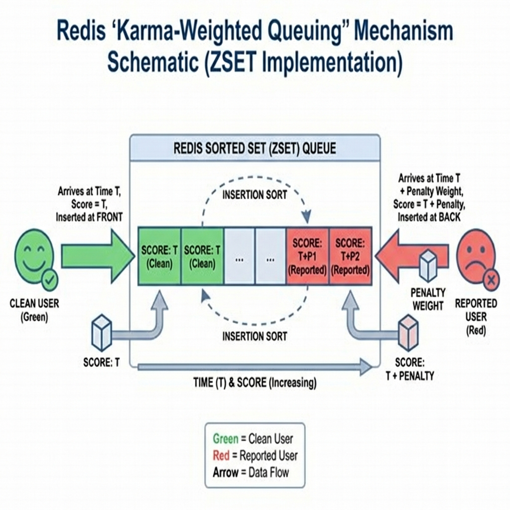

# Klymo Project Documentation: Backend Enforcement & Safety Systems

**Date:** February 4, 2026  
**Author:** Development Team

## Introduction

This document outlines the technical implementation of the new Backend Limit Enforcement and User Reporting/Banning systems for the Klymo chat application. These features were introduced to enhance platform security, fairness, and user safety by moving critical logic from the client-side to a secure server-side environment.

---

## 1. System Architecture

The system leverages a **Node.js** backend paired with **Redis** for high-speed, in-memory state management.

- **Frontend**: React (Vite) with Socket.IO Client.
- **Backend**: Node.js with Socket.IO Server.
- **Data Store**: Redis (used for queues, limits, and temporary ban records).
- **Identification**: FingerprintJS (Device ID) for tracking users across sessions without login.

---

## 2. Advanced Queuing Architecture

The matchmaking system is built on **Redis Sorted Sets (ZSET)**, offering performance and flexibility far beyond standard FIFO lists.

### Time-Priority Sorting
Match candidates are scored by granular timestamps ($T_{entry}$).
1. **Efficiency**: `ZADD` and `ZRANGE` operations differ effectively $O(\log N)$, ensuring sub-millisecond matching even with thousands of concurrent users.
2. **Safety**: Atomic operations prevent race conditions (double-matching) without locking the entire queue.

### Weighted Prioritization (Active)
The system actively uses **"Karma-Weighted Queuing"** to ensure fair play.

*Figure 1: Visualizing the Karma Penalty: Reported users are "weighed down" and inserted later in the queue.*

- **Concept**: Users with reports are deprioritized (Shadow-banned) without being fully blocked.
- **Implementation**:
  $$ Score = T_{entry} + (ReportCount \times 12000ms) $$
- **Result**: Each report adds a **12-second delay penalty** to the user's effective queue position. Clean users (ReportCount 0) are always matched first.

---

## 3. Backend Specific Match Limits

To prevent abuse of specific gender filters (e.g., searching only for "Female"), a daily limit is enforced securely on the backend.

### Mechanism
Originally, limits were tracked in LocalStorage, which was vulnerable to clearing. The new system uses Redis keys with automatic expiration.

- **Key Structure**: `limit:{deviceId}:{date}`
- **Limit**: 5 specific matches per day (e.g., filtering by "Female").
- **Unlimited "Any" Matching**: Standard random matching (selecting "Any") is **unlimited**. The limit only applies to filtered searches to prevent abuse of preference filters.
- **Expiry**: Keys expire automatically after 24 hours.

### Workflow
1. User initiates a search with a specific preference (e.g., "Male").
2. `join_queue` event is sent to the backend.
3. Backend calls `checkLimit(deviceId)`.
4. If limit is reached, an error is emitted, and the user cannot join the queue.
5. If limit is valid, user joins the queue.
6. Upon finding a match, `incrementLimit(deviceId)` is called, increasing the count in Redis.
7. Frontend receives `limit_update` to reflect the new remaining count.

---

## 4. Persistent Reporting & Automated Banning

To maintain a safe environment, users can report bad actors. The system is designed to prevent "gaming" of the ban logic through persistence and strict identity tracking.

### Reporting Logic & Retention
- **Trigger**: User clicks "Report" in the chat interface.
- **Data**: The reporter sends the target's `deviceId` (hidden from UI) to the backend.
- **Storage**: Redis increments a counter at `reports:{targetDeviceId}`.
- **7-Day Retention**: Report counts persist for **7 days**. A user cannot simply "wait out" a few reports by leaving for a few hours. This sliding window ensures consistent bad behavior is punished.

### Ban Enforcement
- **Threshold**: 10 reports within the retention window.
- **Penalty**: 24-hour ban from all matching queues.
- **Real-Time Action**: Active socket connections are inspected; if a ban is triggered during a session, the user is disconnected immediately.

---

## 5. Resilient Hybrid Verification System

Klymo employs a dual-layer verification pipeline that prioritizes accuracy while guaranteeing system availability (Fail-Safe architecture).

### Layer 1: High-Precision Backend AI
The primary verification relies on a **Python FastAPI** service hosting a Hugging Face Vision Transformer (ViT).
1. **Process**: Image is sent securely to the backend.
2. **Timeout Guard**: The request races against a **5-second timeout**. If the backend is slow or unresponsive, the client automatically aborts.

### Layer 2: Client-Side Failsafe (FaceAPI.js)
If the backend times out or returns a 500 error, the system seamlessly switches to `face-api.js` running locally in the browser.
- **Zero Downtime**: Users are never blocked by server issues.
- **Privacy Preserved**: In fallback mode, image analysis happens entirely on the user's device.

---

## 6. Security & Anonymity: The "No-Login" Architecture

The system relies on **Device Fingerprinting** (FingerprintJS) rather than user accounts. This adheres to Klymo's core anonymity principle while providing accountability.

- **Immutable Identity**: Clearing cookies or using Incognito mode does not reset the ID, preventing users from evading bans or limits easily.
- **Transient Data**: No emails, phone numbers, or passwords are ever stored. User identity is purely algorithmic.

---

## Conclusion

The migration of limit logic to the backend and the introduction of a Redis-based reporting system significantly harden the application against client-side tampering and toxic behavior, ensuring a scalable and safer user experience.
